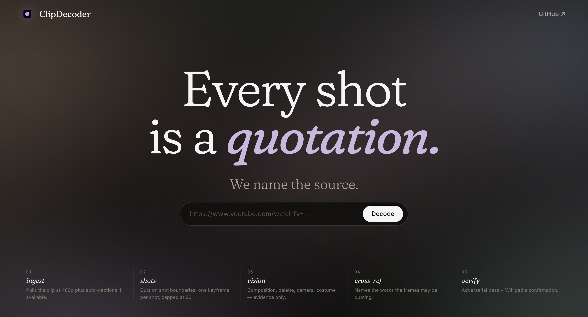

# ClipDecoder

> ⚠️ **Work in progress.** This repository is public for transparency, but the project is still under active development. Interfaces, data layout, and pipeline behaviour can change without notice; expect rough edges and breaking commits on `main`.

Local-first tool that decodes the visual references in YouTube music videos using NVIDIA NIM endpoints.



## Quick start (Docker — recommended)

1. Get a free NVIDIA NIM API key at https://build.nvidia.com (creates an `nvapi-...` key with 1000 inference credits).
2. Copy `.env.example` to `.env` and fill `NVAPI_KEY`.
3. Run `docker compose up --build`.
4. Open http://localhost:3000 and paste a YouTube URL.

> **Deployment scope.** The backend currently has no authentication or per-IP
> rate limiting on `/api/analyze`. It is designed for **local single-user use**.
> Don't expose port 8000 to the public internet — anyone who can reach it can
> spawn pipeline runs against your NIM credits.

## Prerequisites (local non-Docker dev)

- **Python 3.12+** and [`uv`](https://github.com/astral-sh/uv) for the backend.
- **Node 22+** and [`pnpm`](https://pnpm.io) for the frontend.
- **`ffmpeg`** on `PATH` (used by yt-dlp + scenedetect). macOS: `brew install ffmpeg`.
- An `nvapi-...` key in `.env` at the repo root.

## How it works

Seven-stage pipeline per clip:

1. **Ingest** — `yt-dlp` downloads a 480p mp4 and auto-captions if available.
2. **Shots** — `PySceneDetect` finds shot boundaries; `ffmpeg` extracts one keyframe per shot (capped at 80, evenly distributed).
3. **Vision** — Cosmos Reason describes each frame: composition, palette, camera, costume/setting, distinctive features. Evidence-only — no speculation about references.
4. **Cross-reference** — Llama 3.x (or Nemotron) takes all frame descriptions and proposes named references to specific works.
5. **Verify** — A second LLM pass adversarially defends each reference; Wikipedia confirms the named work exists. Each reference lands in one of three buckets: `confirmed`, `speculative`, `hidden`.
6. **Enrich** — For kept references, fetch Wikidata claims (genre, director, performer, location, inception, etc.) dispatched by `work_type`, with French labels preferred and English fallback. Disable with `WIKIDATA_ENRICHMENT=false`.
7. **Lyrics × Visuals** — When the clip has captions, a final LLM pass pairs notable lyric lines (from YouTube auto-captions) with the on-screen frame at that moment and labels the connection (literal, motif, contrast, amplification). Surfaced in the report behind a "Lyrics × Visuals" tab. Disable with `LYRICS_LINKING=false`. Clips without captions simply omit the tab.

While the pipeline runs, `/report/{id}` streams events over SSE: the keyframe strip fills shot-by-shot, the log tails NIM activity, and candidate cards land as they are proposed. When the run finishes, the same URL flips to the final report: the embedded YouTube player on the left, reference cards on the right (click a card to seek). Each card opens a detail page at `/report/{id}/ref/{n}` with an in-page player cued to the timestamp, the source frame and palette, full frame analysis, and the cross-ref / adversarial / Wikipedia reasoning for that reference.

## Configuration

See `.env.example`. Key knobs:

- `MAX_SHOTS_PER_VIDEO` (default 80) — caps NIM calls per analysis.
- `NIM_CONCURRENCY` (default 8) — parallel frame analyses + verify calls. Drop to 4 if NIM rate-limits your key.
- `WIKIPEDIA_VERIFICATION` (default true) — set false to skip Wikipedia checks.
- `WIKIDATA_ENRICHMENT` (default true) — set false to skip the Wikidata claim fetch.
- `WIKIDATA_CONCURRENCY` (default 4) — parallel Wikidata requests during enrichment.
- `WIKIDATA_TIMEOUT_S` (default 10.0) — per-request timeout for the Wikidata API.
- `LYRICS_LINKING` (default true) — set false to skip the lyrics↔visuals linking pass (and its extra LLM call).
- `MAX_LYRIC_LINKS` (default 10) — maximum lyric↔visual pairings surfaced.

Hard limits enforced in code (edit `backend/app/pipeline/ingestor.py` to change):

- **Max clip duration: 15 minutes.** Longer videos are rejected at ingest.
- **Max download size: 300 MB.** yt-dlp aborts past this.

## Local development

Backend:
```bash
cd backend
uv sync
uv run uvicorn app.main:app --reload
```

Frontend:
```bash
cd frontend
pnpm install
pnpm dev
```

Tests:
```bash
cd backend && uv run pytest
cd frontend && pnpm test
```

End-to-end test (real NIM, **consumes credits**, requires `NVAPI_KEY`):
```bash
cd backend && uv run pytest -m e2e
```

Hot-reload dev stack via Docker (both frontend + backend with volume mounts):
```bash
docker compose -f docker-compose.dev.yml up --build
```

## Data retention

Each analysis writes:

- `backend/data/downloads/<youtube_id>.mp4` — deleted once frames are extracted.
- Auto-caption files are downloaded next to the mp4, parsed, then deleted — no subtitle file is kept.
- `backend/data/frames/<youtube_id>/*.jpg` — kept forever (served to the report page).
- `backend/data/clipdecoder.sqlite` — one row per analyzed clip, kept forever.

There is no automatic pruning. Clear the directories manually when disk fills up:

```bash
rm -rf backend/data/frames/ backend/data/clipdecoder.sqlite
```

## Limitations

- YouTube only.
- Some age-restricted or region-locked clips will fail without cookies.
- Visual reference detection is open-ended; the system errs toward "speculative" rather than risking false confidence.
- No multi-user isolation, no rate limiting, no auth — local-only deployment.

## License

MIT — see `LICENSE` at the repo root.
